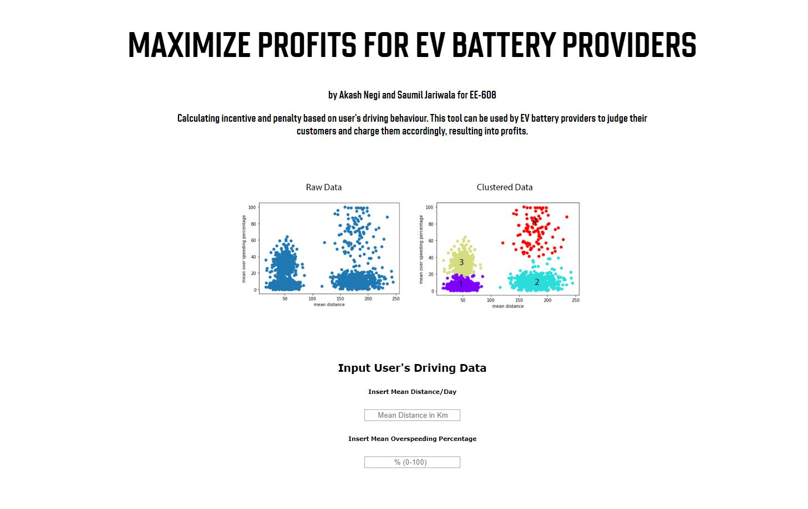
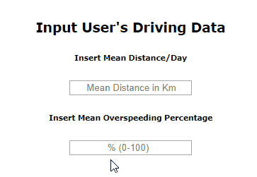

### max-profit-ev-battery
# Maximize Profits for EV Battery Providers

Calculating incentive and penalty based on user's driving behaviour. This tool can be used by EV battery providers to judge their customers and charge them accordingly, resulting into profits.
\
\
**DATA:**

- We are using behaviorial data of users that includes "Mean Distance/Day" and "Mean overspeeding percentage"

**WORKFLOW:**

- Use Expectation Maximization technique K Means to form clusters of drivers (without using sklearn)
- Label the clusters as Incentive, Normal, Low Penalty and High Penalty
- Predict using KNN, a new user's data, belongs to which cluster and charge accordingly
- Build an interactive dashboard for the EV battery provider to use (not in this notebook file)

**CHARGING METHOD:**\
 
- Cluster 1 : Incentive
- Cluster 2 : Normal
- Cluster 3 : Low Penalty
- Cluster 4 : High Penalty

\
\
Companies can input their user's data and decide which cluster they fall into.\
It is upto the company to decide the incentive and penalty values as per the profits they want.
